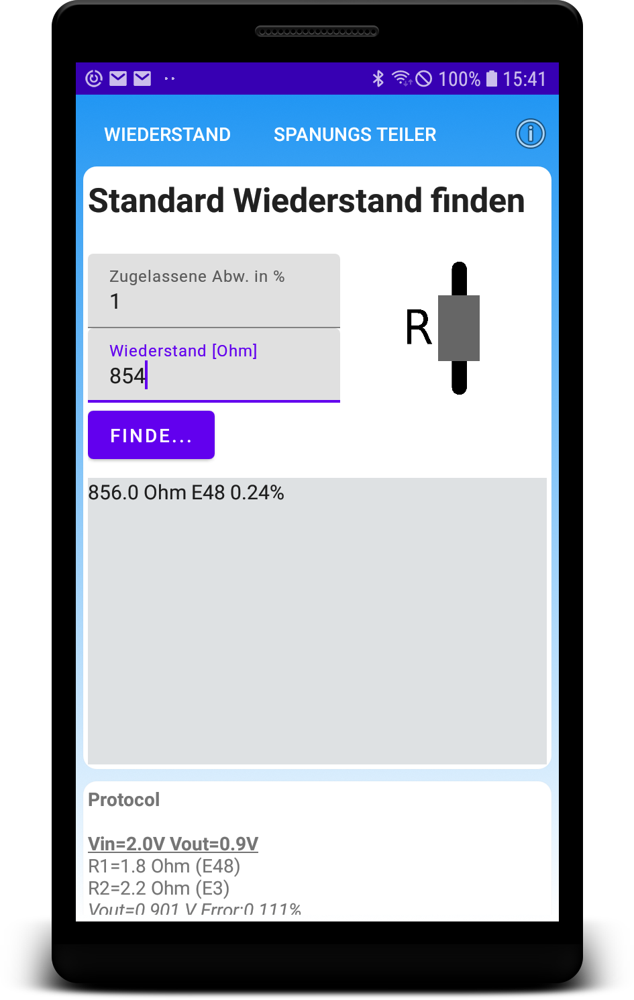
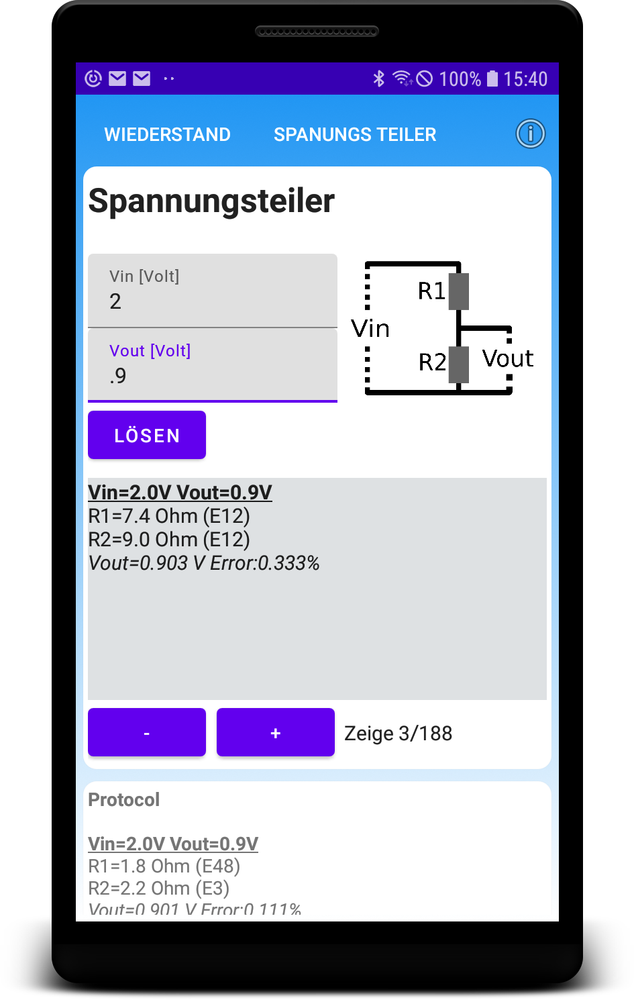

Voltage Divider App
-------------------
Find resistors in any of the standard series. Find best combination of R1 and R2 of an voltage divider. Quick and easy.

A java library for use in one's own projects can be found here:
[Resistor Library](https://github.com/codingbychanche/resistors)

Screenshots
-----------

Find any standard resistor value. Value closest and series in which it was found are displayed.

Find best solution for R1 and R2 of an voltage divider. Resistors, resulting output voltage and errors are displayed. It is possible to browse through all solutions found.

Have fun.